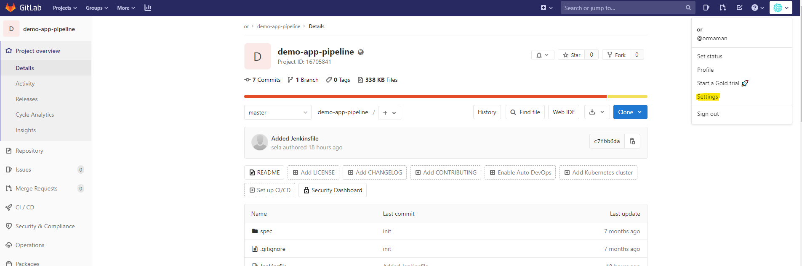
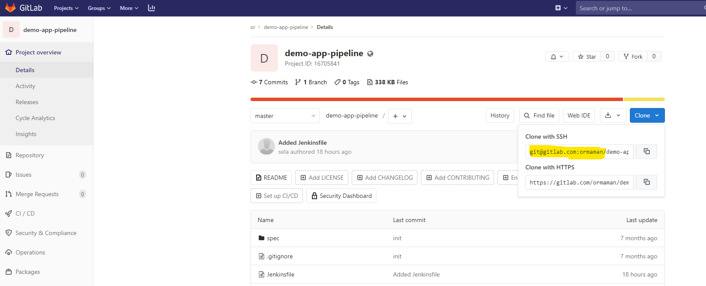
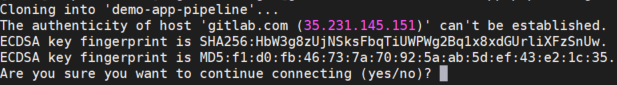

# Creating a Jenkins Pipeline
--- 

## Preparation

 - Please login to your gitlab.com account or open an account  [here](https://www.gitlab.com)

### Import the lab repository

- Note that I will use Gitlab, but you can use Github as well

 - Browse to the Gitlab server, login and go to "projects" tab and click on "new project"
 


 - Select "import" repository, repo by url and paste the url down below
 
```
https://gitlab.com/sela-devops/courses/jenkins-cicd/demo-app.git
```


 - Set the project name
 
```
demo-app-pipeline
```


 - Set the visibility level as "Public"
 


---

### Configure an SSH key

 - Please login to your **Infrastructure** server and Create a new SSH key by runnig the commands below:

```
ssh-keygen -o -t rsa -b 4096 -C "email@example.com"
```

 - Keep all the defaults (press enter 3 times)

```
ssh-keygen -o -t rsa -b 4096 -C "youremail@email.com"
Generating public/private rsa key pair.
Enter file in which to save the key (/home/sela/.ssh/id_rsa):
Created directory '/home/sela/.ssh'.
Enter passphrase (empty for no passphrase):
Enter same passphrase again:
Your identification has been saved in /home/sela/.ssh/id_rsa.
Your public key has been saved in /home/sela/.ssh/id_rsa.pub.
The key fingerprint is:
SHA256:vBIzDb8yL+F52QxBWQDDJm8+drwqmrHq0ZGNKhzdQGQ youremail@email.com
The key's randomart image is:
+---[RSA 4096]----+
|  .E .o..+.      |
|  o . o.o        |
|   . +..         |
|  . * o=.        |
| . = =+.S.       |
|. + . =++o       |
|.+.. o+=o*       |
|. .+. +=+ o      |
|oo+. ..+.        |
+----[SHA256]-----+
```
 
 - Print the public key by run the command below:
 
```
cat ~/.ssh/id_rsa.pub
```

 - Copy the public key to grant permissions in gitlab, it should look like this format:
 
```
ssh-rsa AAAAB3NzaC1yc2EAAAADAQABAAACAQDTjRGnHjiOHJmajna+J+hqKxqPqQ5ryN4enaKEINRYIu1S7hj3egDcSIkOorWZ1P/XT/SSwu0AsjEUtZvl0zMS7LAGfH5YDE2pI9j30qGjDf7pKaNbz13ZaW/O8D+QQtZwVylsL3hmurJsESlPTtfRQ8Qf7P80giD+2FoVjsAKTJzYN1sblUVhPJlfkl+FvTemByCUEw58WE03+sbwvFqzFUIg/i1ENj0jZ/XOnwKIhudoA3HMzTcAERaQ58iijMp462VD/M8OevpwF9uQWdJHFDOlFZaGYsGjc98ESjB2fGAvTNwXeSO46GY2rHe3oO/RLIiQe7yhJ70jdzMEUAmPkpOZZbHgahAWVERPrm9Xs8uIrvp0nKpSzFWfwkZje3mZ89ozPcOx2mS1/1f4jX/z8RGvAnA1viDPSvdaUroI1PTZgkhyjRTLK9wBzzpoQQRRSzYdW5QXx9SNH+sTuJFEckC1bruTb3X58t1GJvc4LgY0pShOjFBJ5XnoTSCwXmmV/78xDzrQrNe8yGbaqfD0Eb/vZUnMBvBtZkx+0LQ4We+dexvTXzdZsKKl1+kHeUxMfAk/yp9Kp8U8F1MCiusVqwPdhPSpuunyYSv9FrLimQ0ce3Hq1fdbZK+DQEVBZY6dK9/vd+QqUk9pdOx2ViC1/0EBBJEabSgDvC2KehXRwQ== youremail@email.com
```

 - Click on your AVATAR section located on your right hand side of the screen -> settings -> SSH Keys
 


 - Paste your SSH key and click "Add Key"


 - Clone the repository on your **infrastructure** server using the SSH url to test your key

```
git clone <Your-New-Repo>
```



 - You will be asked to confirm that you trust the server, Write "yes" 



---

## Instructions

### Create a Jenkins Pipeline from script

 - In the jenkins portal click on **New view**
 


 - Enter **pipeline** and click on **ok** button and another **ok** on the next window


 - Go to the pipeline folder


 - Create a new job by click "New Item"
 


 - Set the job name "pipeline-*your-name*" and select "Pipeline"


 - In the pipeline section choose "Pipeline script" definition:


 - Configure the build process by the following blueprint (use the "Pipeline Syntax" link for help) [link](https://jenkins.io/doc/book/pipeline/syntax)
```
Stage 01 -> Get sources (git clone)
Stage 02 -> npm install
Stage 03 -> npm test
Stage 04 -> npm run build
Stage 05 -> Archive artifacts

(the job must run in your infrastructure server)
```

 - Run the job and ensure that success (To get the solution click [here](./metrials/solution.txt))

---

### Create a Jenkins Pipeline from source control 

 - Now we want the jenkins script to run from an actual file sourced in gitlab rather than from an inline section on jenkins server

 - In the root of the repository create a file called "Jenkinsfile"


 - As the content of the file set the content of the job except the get sources step


 - Finally Update the jenkins job to work with SCM instead of inline script (using the https url)


 - Trigger the build and ensure it success
